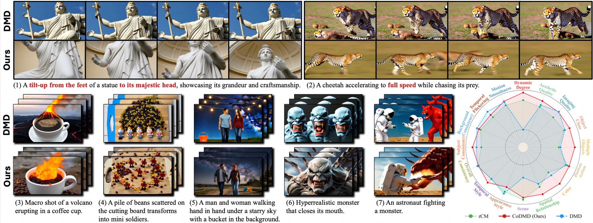
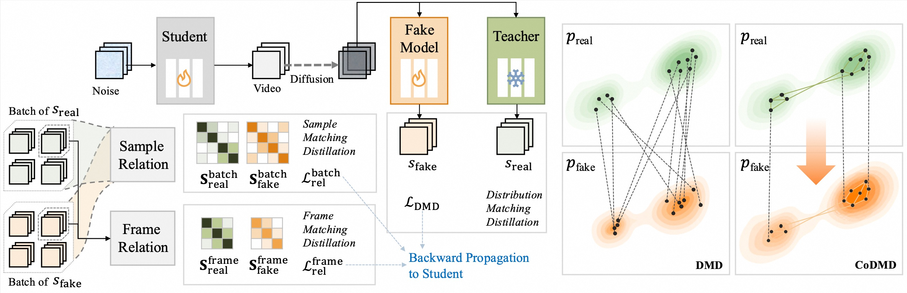

<div align="center">

# CoDMD: Copula-Aware Distribution Matching Distillation for Video Generation

[](https://arxiv.org/abs/XXXX.XXXXX)
[](https://andrew-zhang98.github.io/CoDMD_page/#)
[](LICENSE.md)

</div>

<p align="center">
  
</p>

**CoDMD** distills Wan2.1 video diffusion models into **4-step** generators while preserving the joint dependency structure across frames and samples via a novel **copula-aware distillation loss**. 

<!-- We support both **Wan2.1-T2V-1.3B** and **Wan2.1-T2V-14B**. -->

## 🎬 Demo Videos

CoDMD performs strongly on fast actions, camera motion, prompt alignment, and vivid color rendering.

**Prompt Alignment** — faithful response to detailed instructions.

<video src="https://github.com/JIA-Lab-research/CoDMD/raw/main/assets/prompt.mp4" width="100%" controls></video>

**Color Rendering** — rich colors and visually pleasing appearance.

<video src="https://github.com/JIA-Lab-research/CoDMD/raw/main/assets/color.mp4" width="100%" controls></video>

**Fast Action** — stable motion under rapid dynamics.

<video src="https://github.com/JIA-Lab-research/CoDMD/raw/main/assets/action.mp4" width="100%" controls></video>

**Camera Motion** — smooth camera movement with coherent structure.

<video src="https://github.com/JIA-Lab-research/CoDMD/raw/main/assets/camera.mp4" width="100%" controls></video>
## Overview

Standard Distribution Matching Distillation (DMD) treats each output element independently, losing the **joint dependency structure** (copula) across video frames and batch samples. CoDMD introduces a **copula-aware distillation loss** that explicitly preserves these relational structures during distillation.

<p align="center">
  
</p>

### Key Features

- **Copula-aware loss** — preserves the joint dependency structure (copula) across frames and samples during distillation, going beyond independent per-element matching
- **Motion preservation** — alleviate the motion degradation commonly seen in few-step distilled models
- **Instruction alignment** — ensure the distilled generator faithfully distinguishes diverse prompts

## 📦 Installation

```bash
# Clone the repository
git clone https://github.com/PLACEHOLDER/CoDMD.git
cd CoDMD

# Create conda environment
conda create -n codmd python=3.10 -y
conda activate codmd

# Install dependencies
pip install -r requirements.txt

# Install the package
pip install -e .
```

<!-- ### Prerequisites

- **Hardware**: 8× NVIDIA A100/H100 GPUs per node (80GB VRAM recommended)
- **Software**: PyTorch 2.1+, CUDA 12.1+
- **Model weights**: Download [Wan2.1-T2V-1.3B](https://huggingface.co/Wan-AI/Wan2.1-T2V-1.3B) or [Wan2.1-T2V-14B](https://huggingface.co/Wan-AI/Wan2.1-T2V-14B) from HuggingFace/ModelScope -->

## 📥 Checkpoint Download

| Model | Backbone | Steps | Download |
|-------|----------|-------|----------|
| CoDMD-1.3B | Wan2.1-T2V-1.3B | 4 | [🤗 HuggingFace](https://huggingface.co/PLACEHOLDER/CoDMD-1.3B) |
| CoDMD-14B | Wan2.1-T2V-14B | 4 | [🤗 HuggingFace](https://huggingface.co/PLACEHOLDER/CoDMD-14B) |

Download and place the checkpoint folder (containing `model.pt`) to your local directory.

## 🚀 Inference

### Single GPU

```bash
python inference.py \
    --config_path configs/wan_dmd_tar.yaml \
    --checkpoint_folder <PATH_TO_CHECKPOINT> \
    --output_folder ./results \
    --prompt_file_path prompts.txt \
    --num_seeds 5
```

### Multi-GPU (DDP)

```bash
torchrun --nproc_per_node=8 --master_port=29600 \
    inference.py \
    --config_path configs/wan_dmd_tar.yaml \
    --checkpoint_folder <PATH_TO_CHECKPOINT> \
    --output_folder ./results \
    --prompt_file_path prompts.txt \
    --num_seeds 5
```

<!-- > **Note**: The `prompts.txt` file should contain one text prompt per line. Each prompt generates `num_seeds` videos with different random seeds. For 14B model, use `configs/wan_dmd_tar_14b.yaml` and set `model_path` in the config. -->

## 🏋️ Training

<!-- ### Data Preparation

CoDMD uses pre-generated tar data with pre-computed T5 embeddings and backward simulation. To prepare the data, generate ODE pairs from a teacher model (e.g., Wan2.1 100-step Euler sampler) and pack them into WebDataset tar shards:

```
tar_data_dir/
├── shard-000000.tar
├── shard-000001.tar
└── ...
```

Each shard contains per-sample files:
- `{idx}.latent.pt` — VAE-encoded video latent `[C, T, H, W]`
- `{idx}.embed.pt` — T5 text embedding `[seq_len, d_model]`
- `{idx}.prompt.txt` — raw text prompt

Update `tar_data_dir` in your config YAML to point to this directory. -->

### Training Wan2.1-T2V-1.3B (32 GPUs)

```bash
export PYTHONPATH=$(pwd):$PYTHONPATH
export PYTORCH_CUDA_ALLOC_CONF=expandable_segments:True

torchrun --nnodes 4 --nproc_per_node=8 --rdzv_id=5235 \
    copula_dmd/train_dmd.py -- \
    --config_path configs/wan_dmd_tar.yaml
```

### Training Wan2.1-T2V-14B (32 GPUs)

```bash
torchrun --nnodes 4 --nproc_per_node=8 --rdzv_id=5235 \
    copula_dmd/train_dmd.py -- \
    --config_path configs/wan_dmd_tar_14b.yaml
```

<!-- > **Tips**:
> - Checkpoints are saved every `log_iters` steps (default: 200) to `output_path/`
> - Monitor training with TensorBoard: `tensorboard --logdir=./outputs` -->

<!-- ## 📂 Project Structure -->
<!-- ```
CoDMD/
├── configs/
│   ├── wan_dmd_tar.yaml          # Config for Wan2.1-T2V-1.3B
│   └── wan_dmd_tar_14b.yaml      # Config for Wan2.1-T2V-14B
├── copula_dmd/
│   ├── copula_loss.py             # Copula-aware distillation loss (core)
│   ├── dmd.py                     # DMD module (generator/critic losses)
│   ├── train_dmd.py               # Training entry point
│   ├── data.py                    # Data loading (tar / text)
│   ├── loss.py                    # Denoising loss functions
│   ├── util.py                    # FSDP utilities
│   ├── scheduler.py               # Noise schedule interface
│   ├── bidirectional_trajectory_pipeline.py
│   └── models/
│       ├── model_interface.py     # Abstract interfaces
│       └── wan/                   # Wan2.1 model wrappers
│           ├── wan_wrapper.py     # Diffusion / T5 / VAE wrappers
│           ├── bidirectional_inference.py
│           ├── flow_match.py      # Flow matching scheduler
│           └── wan_base/          # Wan2.1 backbone (third-party)
├── inference.py                   # Inference script (single/multi-GPU)
├── scripts/
│   ├── train.sh                   # Training launch script
│   └── inference.sh               # Inference launch script
├── assets/                        # Figures and demo videos
├── requirements.txt
├── setup.py
└── README.md
``` -->


## 🙏 Acknowledgement

This project builds upon the following excellent works:

- [Wan2.1](https://github.com/Wan-Video/Wan2.1) — the base video model
- [CausVid](https://arxiv.org/abs/2502.14081) — training framework
- [rCM](https://arxiv.org/abs/2510.08431) — pre-sampled dataset


We thank the authors for their outstanding contributions to the community.

## 📝 Citation

If you find this work useful, please cite:

```bibtex
@article{codmd2025,
  title={CoDMD: Copula-Aware Distribution Matching Distillation for Video Generation},
  author={Your Name},
  journal={arXiv preprint arXiv:XXXX.XXXXX},
  year={2025}
}
```
